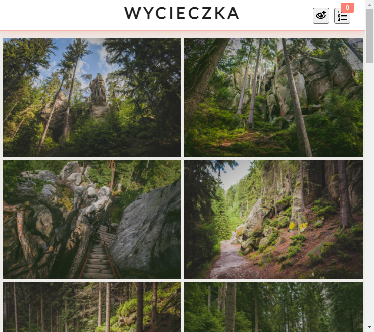
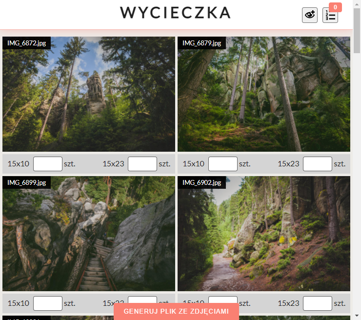

## WYBORNIK


The site can be useful for photographers. You provide photos to the client who selects the size and number of photos for printing.  

Selected photos can be generated to a csv file and sent to the photographer ;)

Everything is saved in localStorage, so even closing or refreshing the page does not remove the selected photos.


## What you will need
The `images` folder with photos in the sources folder.
Photo list - `images.json`, see in the sources folder.  
The main folder there should also be two configuration files: `.env.dev` and `.env.prod`

```bash
# tiitle site
WYBORNIK_TITLE=WYCIECZKA

# in development version, json is served from json-server
# on production it must be a link to the static images.json file
WYBORNIK_API=http://localhost:3000/images

# based on this variable you set the path to the photos
# prod WYBORNIK_LOCAL=FALSE 
WYBORNIK_LOCAL=TRUE 

# images sizes
WYBORNIK_TYPE_IMAGE=15x10,15x23
```

The `.env.prod` file should contain production data

## Clone the repo and install dependencies
```bash
git clone https://github.com/tomik23/wybornik.git
cd wybornik
yarn
# or
npm i
```

## Watch/Build the app
Watch the app, just call:

```bash
yarn dev
# or
npm run dev
```

Build app:

```bash
yarn prod
# or
npm run prod
```

## How to generate json file with images
```bash
yarn json
# or
npm run json
```

## The appearance of the site

### Look after entering


### Appearance after turning on the selection of the number and size of photos


### List of selected photos, sizes and quantities
