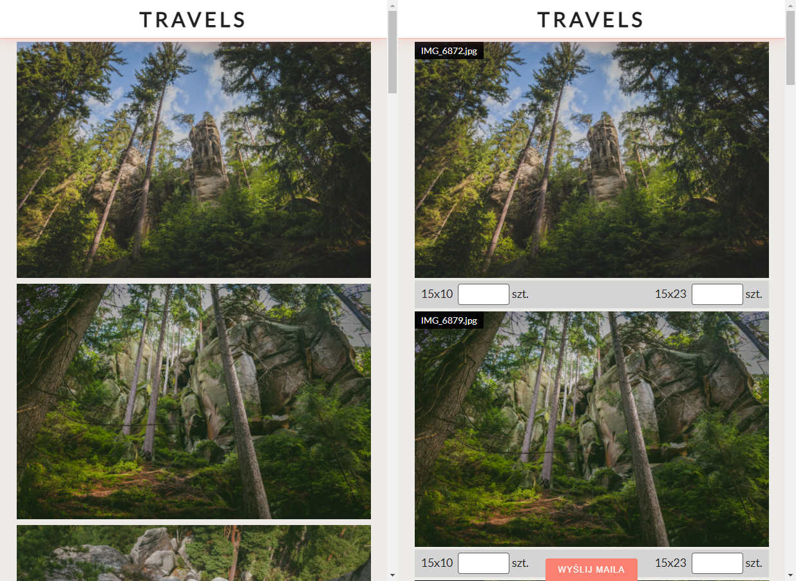

## WYBORNIK
The site can be useful for photographers. You provide photos to the client who selects the size and number of photos for printing.



## What you will need
The `images` folder with photos in the main folder.
In the main folder there should also be two configuration files: `.env.dev` and `.env.prod`

The `.env.prod` file should contain production data

## Clone the repo and install dependencies
```bash
git clone https://github.com/tomik23/wybornik.git
cd wybornik
yarn
# or
npm i
```

## Watch/Build the app
Watch the app, just call:

```bash
yarn dev
# or
npm run dev
```

Build app:

```bash
yarn prod
# or
npm run prod
```

## How to generate json file with images
```bash
yarn json
# or
npm run json
```